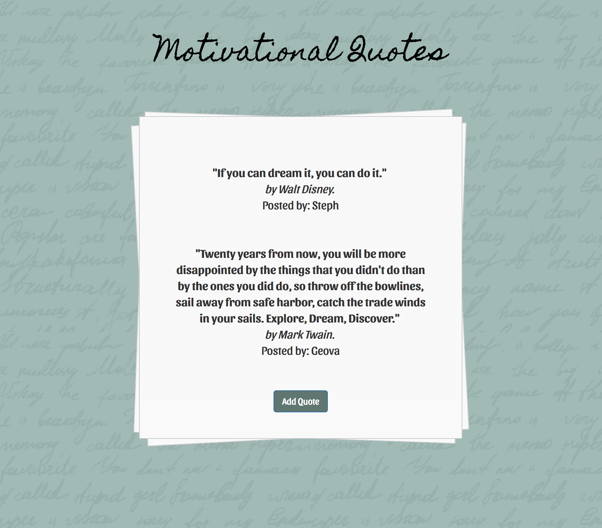

# MOTIVATIONAL APP

This motivational app is a simple site where the user can add their favorite quotes by their favorite authors and have it displayed online.

The user has to click on the "Add Quote" button to be able to add their quotes to the site. Once the user clicks there, they will see a window with input boxes to add their motivational quote, the author of that quote and their personal name. Once the info has been added, the user will have to click "Submit" and it will be displayed online.

[Link to the live site] (https://motivational-quotes-app.herokuapp.com/)

## Technologies Used
- MVC file structure
- Node.js
- Express.js
- MongoDB and Mongoose
- Heroku for deployment
- Ajax
- HTML, CSS and JS

## Desktop View

